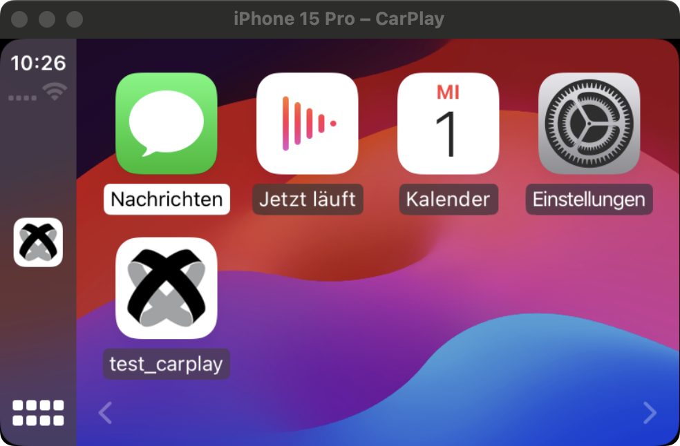

# Titanium Car Play

Use the Apple CarPlay framework in the Titanium SDK. **Note**: This is a complete Swift rewrite of the original Ti.CarPlay module and does not share backwards compatibility.

## Requirements

- [x] Titanium SDK 12.3.0+ (or [this change](https://github.com/tidev/titanium-sdk/pull/13941))
- [x] iOS 14+
- [x] Xcode 15+
- [x] Approved CarPlay entitlements from Apple

## Architecture

The architecture of this project is meant to be as close to the Swift API as possible. Therefore, templates, methods
and properties are the named the same as natively. The typical flow is that you provide a default template inside
the `TiCarPlaySceneDelegate` class (recompile the module afterwards) and then control your full UI from the JavaScript
side. If you need initial logic in the module, you can use the `UserDefaults` API to load cached data from your main app
that was set via the `Ti.App.iOS.UserDefaults` API. Remember to configure a proper group name for your app first. 

## Example

See the example/app.js for details

## Author

Hans Knöchel

## License

MIT